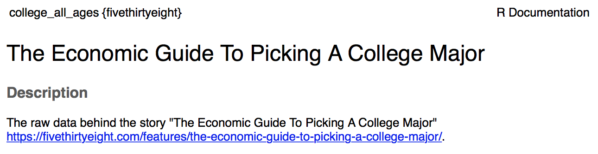

```{r setup, include=FALSE}
knitr::opts_chunk$set(echo = TRUE)
```

## 1. FiveThirtyEight Data

### a. Install the fivethirtyeight package.

```{r}
library(fivethirtyeight)
```

### b. In the listing of Data sets in package ‘fivethirtyeight,’ assign the eighteenth data set to an object ‘df.’

Looks like this assignment is outdated and the dataset is not 18th in the list anymore, but 20th.

```{r}
as.character(data(package = "fivethirtyeight")$results[20, 'Item'])
df <- data(college_all_ages)
```

### c. Use a more detailed list of the data sets to write out the URL in a comment to the related news story.

```
?college_all_ages
```




### d. Using R command(s), give the dimensions and column names of this data frame.

```{r}
dim(college_all_ages)
colnames(college_all_ages)
```


## 2. Data Summary.

### a. Write an R command that gives you the column names of the data frame. Right after that, write one that counts the number of columns but not rows. Hint: The number should match one of your numbers in Question 1d for dimensions.

```{r}
colnames(college_all_ages)
length(colnames(college_all_ages))
```

### b. Generate a count of each unique major_category in the data frame. I recommend using libraries to help. I have demonstrated one briefly in live-session. To be clear, this should look like a matrix or data frame containing the major_category and the frequency it occurs in the dataset. Assign it to major_count.

```{r}
major_count <- aggregate(college_all_ages, by=list(college_all_ages$major_category), length)[, c('Group.1', 'total')]
colnames(major_count) <- c('major_category', 'count')
major_count
```

### c. To make things easier to read, enter par(las=2) before your plot to make the text perpendicular to the axis. Make a barplot of major_count. Make sure to label the title with something informative (check the vignette if you need), label the x and y axis, and make it any color other than grey. Assign the major_category labels to their respective bar. Flip the barplot horizontally so that bars extend to the right, not upward. All of these options can be done in a single pass of barplot(). Note: It’s okay if it’s wider than the preview pane.

```{r}
op <- par(mar = c(10,10,4,2) + 0.1)
barplot(major_count$count, names.arg=major_count$major_category, xlab="Count", las=2, cex.names=.5, las=2, horiz = TRUE)
par(op) 
```

### d. Write the fivethirtyeight data to a csv file. Make sure that it does not have row labels.

```{r}
write.csv(college_all_ages, file='college_all_ages.csv', row.names=FALSE)
```

## 3. Codebook 

link to a project in GitHub: https://github.com/VolodymyrOrlov/MSDS6306_hw4
